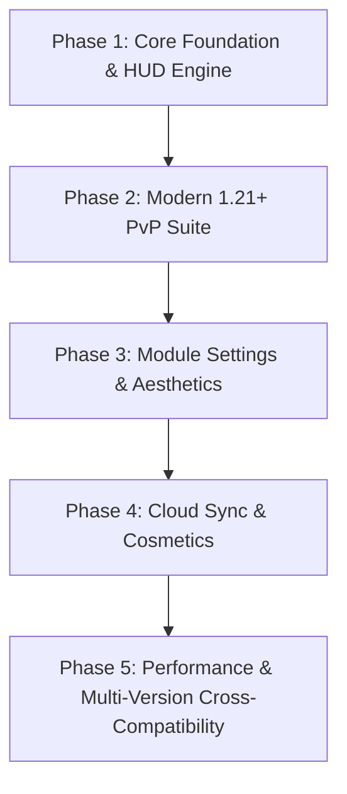

# 🧊 Ice Client - Master Development Roadmap & Strategic Plan

## 📌 Executive Summary
**Ice Client** is a next-generation competitive Minecraft client ecosystem consisting of:
1. **Fabric In-Game Client Mod** (1.21.1+): 32+ high-performance HUD, PvP, and visual utility modules built on a glassmorphic rendering engine.
2. **Standalone Custom Launcher**: Multi-threaded asset/native engine, 1000 FPS JVM argument tuning, Modrinth integration, and automated profile lifecycle manager.

---

## 🗺️ Multi-Phase Roadmap

---

### 🟢 Phase 1: Core Foundation & HUD Engine (COMPLETED)
- [x] Fabric 1.21.1 Loom setup with Java 21 LTS support.
- [x] Base `Module` abstract model with glassmorphic backdrop rendering (`0xCC0D1117`).
- [x] `ModuleManager` registry with persistent JSON serialization (`config/iceclient/modules.json`).
- [x] In-Game Right Shift ClickGUI (`IceClientGuiScreen`) with search bar and category filtering.
- [x] Interactive Drag-and-Drop HUD Positioner (`HudPositionerScreen`).
- [x] Non-invasive Mixins (`GameMenuScreenMixin`, `TitleScreenMixin`, `KeyboardMixin`, `MinecraftClientMixin`).

---

### 🟢 Phase 2: Modern 1.21+ PvP Suite (COMPLETED)
- [x] 1.21 Mace Stomp Bonus Damage & Height Multiplier (`MaceModule`).
- [x] Attack Cooldown Readiness Indicator (`AttackCooldownModule`).
- [x] 1.21 Wind Charge & Breeze Rod Inventory Counter (`WindChargeModule`).
- [x] End Crystal & Nether Respawn Anchor Counter (`CrystalAnchorModule`).
- [x] Shield Break & Axe Stun Cooldown Countdown (`ShieldStatusModule`).
- [x] Low Armor Durability Warning (< 15% durability alert) (`ArmorWarningModule`).
- [x] Jump Reset Knockback Timing Tracker (`JumpResetModule`).
- [x] Target HUD with live entity health bar and distance (`TargetHudModule`).

---

### 🟢 Phase 3: Per-Module Customization & Aesthetics (COMPLETED)
- [x] Modular Setting Framework: `BooleanSetting`, `ColorSetting`, `ModeSetting`, `NumberSetting`.
- [x] Universal settings on every module: Accent Color, Glass Background, Drop Shadow, Border Glow, Scale.
- [x] Dedicated `ModuleSettingsScreen` accessible via `⚙️` Gear button on cards.
- [x] F3 Debug screen & F1 screenshot auto-hide hooks.

---

### 🟡 Phase 4: Cloud Profiles, Keybinds & Custom Cosmetics (UPCOMING)
- [ ] **Cosmetics Engine**: Client-side animated capes, wings, halos, and custom player hats.
- [ ] **Profile Cloud Sync**: Export and share module configurations via 6-digit codes or JSON share links.
- [ ] **Custom Keybind Manager**: Bind individual modules to dedicated keyboard hotkeys.
- [ ] **Freelook / Perspective 360 Mode**: Smooth 360-degree camera orbit while holding keybind without turning character.

---

### 🟡 Phase 5: 1000 FPS Mega-Optimization & Cross-Version Suite (UPCOMING)
- [ ] **Multi-Version Protocol Translation (ViaFabricPlus)**: Join 1.8.9 through 1.21.11 servers from a single 1.21 client.
- [ ] **Direct OpenGL Memory Allocator**: Fine-tune vertex batching in `ImmediatelyFast` and `Sodium` pipelines.
- [ ] **Headless Auto-Benchmarking Suite**: Built-in FPS benchmark tool measuring 1% lows and frame pacing across real PvP scenarios.
